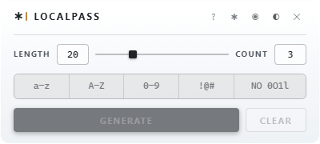

# LocalPass

A password generator that keeps everything on your computer.

<picture>
  <source media="(prefers-color-scheme: dark)" srcset="docs/localpass-expanded-dark.png">
  
</picture>

<picture>
  <source media="(prefers-color-scheme: dark)" srcset="docs/localpass-collapsed-dark.png">
  
</picture>

LocalPass makes strong passwords, shows them in a compact floating window,
and copies one to the clipboard when you ask. On Windows and Linux X11 it
removes the password from the clipboard again after a short timer; on macOS
that is an opt-in you turn on each session. It saves nothing to disk. It
never connects to the internet. Closing clears generated results from the
app; clipboard cleanup follows the platform policy below.

LocalPass makes passwords. It does not store them. There is no vault, no
sync, and no account.

Use it when you need a strong password now and do not want the generator
to be a browser extension, a web page, or a cloud service. It suits IAM
administrators, help-desk staff, and developers who set credentials for
other people, and anyone who wants the generator to stay on their own
machine.

Built with Tauri 2. Windows is the only platform tested by hand today. macOS
and Linux compile and pass CI, but no one has run them on real hardware yet.
macOS builds are not signed or notarized. Read [Status](#status) before you
build.

## Status

| Platform | State |
| --- | --- |
| Windows x64 | Built and tested by hand. Primary target. |
| macOS (Apple Silicon and Intel) | Compiles and passes tests in CI. Not yet tested on real hardware. Not signed or notarized. |
| Linux X11 | Compiles and passes tests in CI. Not yet tested on real hardware. |
| Linux Wayland | Runtime unverified, like X11. By design, COPY is unavailable: the toolkit does not expose a safe per-entry clipboard handle. See [Clipboard by platform](#clipboard-by-platform). |

There are no downloadable releases yet. To use LocalPass today,
[build it from source](#build). On macOS the build is unsigned, so
Gatekeeper will warn you when you first open it.

## Use

1. Choose a length from 4 to 64 characters.
2. Choose how many passwords to make, from 1 to 99.
3. Turn character groups on or off: lowercase, uppercase, numbers, and
   symbols (`!@#$%^&*_-+=?`). Turn on **NO 0O1l** to remove characters that
   look alike (`Il1O0o5S8B`).
4. Press **GENERATE**. Each password contains at least one character from
   every group you turned on.
5. Press **COPY** next to the password you want. On Windows and Linux X11
   the clipboard clears itself after the timer. The default is 30 seconds.
   You can set 5 to 60 seconds in the About panel. The **?** button opens
   the About panel.
6. Press **CLEAR** to remove all passwords from the window and release the
   clipboard where the platform policy allows. **✕** does the same and
   closes the app.

> **macOS users, read this first.** LocalPass does not clear the clipboard
> on macOS unless you turn clearing on, and the setting is off again every
> time the app starts. Until you turn it on, the timer, **CLEAR**, and
> **✕** all leave the copied password on the clipboard. See
> [Clipboard by platform](#clipboard-by-platform).

The header has five buttons:

| Button | What it does |
| --- | --- |
| **?** | Opens the About panel. |
| **✱** | Hides every password. Click a hidden password to show it. |
| **◉** | Keeps the window on top of other windows. On by default. Click to let other windows cover it. |
| **◐** | Switches between dark and light theme. |
| **✕** | Closes the app. Clears the clipboard on Windows and Linux X11. |

When the window loses focus, every password hides at once, no matter what
**✱** is set to.

When you click somewhere else, the window shrinks to a thin bar. Click the
bar to open it again. Drag the bar to move it. Pointing at the bar does not
open it; only a click does.

The About panel also sets the transparency of the thin bar and the macOS
clipboard option. All settings go back to their defaults when you close the
app.

Keyboard shortcuts:

| Keys | Action |
| --- | --- |
| `Ctrl+G` or `Cmd+G` | Generate |
| `Ctrl+L` or `Cmd+L` | Clear |
| `Ctrl+=` or `Cmd+=` | Zoom in |
| `Ctrl+-` or `Cmd+-` | Zoom out |
| `Ctrl+0` or `Cmd+0` | Reset zoom to 100% |
| `Alt+F4` or `Cmd+Q` | Close. Clears the clipboard on Windows and Linux X11. |

If you start LocalPass twice, the second copy exits. The first one is not
changed.

## How it stays secure

LocalPass has two parts. The **window** is what you see and click. It is a
small web page. The **Rust core** is the part that does the sensitive work.
Only the Rust core can make passwords or touch the clipboard. The window can
only ask. Think of the window as a counter and the Rust core as the back
office.

- **Randomness comes from the operating system.** LocalPass uses the same
  random source the OS uses for encryption keys. Every draw uses
  [rejection sampling](https://en.wikipedia.org/wiki/Rejection_sampling),
  so within the set being drawn from, each character is equally likely; no
  modulo bias. Generation draws one character from each group you turned
  on, fills the remaining positions from all enabled characters together,
  then runs a
  [Fisher-Yates shuffle](https://en.wikipedia.org/wiki/Fisher%E2%80%93Yates_shuffle)
  so the guaranteed characters land at random positions. Because of that
  one-per-group guarantee, a character from a small group (the 13 symbols)
  is somewhat more likely to appear than a character from a large group
  (26 lowercase letters). That is the cost of guaranteeing every group is
  represented. If the OS random source is not available, LocalPass refuses
  to make a password. It never falls back to a weaker method.
- **The Rust core keeps the passwords.** Generated passwords live in Rust
  memory that is wiped when no longer needed. The window gets a copy to
  display, plus an ID number for each row. When you press **COPY**, the
  window sends the ID, not the password text.
- **The window cannot reach the clipboard.** Copy, cut, drag, right-click
  menus, and every browser clipboard API are turned off. Only the Rust core
  writes to the clipboard, and only when you press **COPY**.
- **LocalPass only clears what it put there.** Before clearing, it checks
  that it still owns the clipboard. If you copied something else in the
  meantime, LocalPass does not change it. The one exception is the macOS
  opt-in race described under [Clipboard by platform](#clipboard-by-platform).
- **Closing is careful.** LocalPass blanks the window before it closes,
  then finishes the platform clipboard cleanup even if the window is
  already gone.
- **The window has a short list of allowed requests.** It cannot read files,
  run programs, open web pages, or download anything. The app has no update
  checker and no telemetry.

What LocalPass cannot protect against:

- Any other program reading the clipboard while your password is on it.
- Malware, screen recording, or clipboard manager apps.
- Someone reading the computer's memory directly.
- A crash, forced shutdown, or power loss before the clipboard clears.

The first and last of these exist only while a password is on the
clipboard. Screen recording and memory inspection apply whenever a password
is on screen, whether or not you press **COPY**. If a secret must never
touch the clipboard, do not press **COPY**; read it from the screen and type
it. That removes the clipboard risks, not the others.

## Clipboard by platform

Each operating system handles the clipboard differently. LocalPass does the
safest thing each one allows.

**Windows.** Passwords are marked so Windows does not save them to Clipboard
History or sync them to other devices. LocalPass checks that it still owns
the clipboard before clearing it. It never erases someone else's copy.

**macOS.**

- Automatic clearing is **off by default**. It turns off again every time
  the app starts.
- While it is off, LocalPass never removes a copied password. The password
  stays on the clipboard until you copy something else.
- You can turn clearing on in the About panel. It applies only to
  passwords you copy after that point.
- macOS cannot check and clear the clipboard in one step. LocalPass checks
  that it still owns the clipboard, then clears it. If another app copies
  between those two steps, LocalPass can clear that copy instead of its own.
- Passwords are marked so they do not sync to your other Apple devices.
- Clipboard manager apps may or may not respect the "do not save" hint.

**Linux X11.** Each copied password gets its own clipboard owner, so LocalPass
can clear exactly that one. It sends the KDE "this is a password" hint and
never asks clipboard managers to keep the value.

**Linux Wayland.** The current toolkit does not give LocalPass a way to own
and later clear only its own clipboard entry. Rather than write something it
cannot safely remove, COPY is disabled and reports "unsupported on this
platform". That is the only Wayland behavior verified today, and it is
verified by reading the code, not by running it. No one has launched the
app on a Wayland desktop yet.

## Build

You need Node 24, stable Rust 1.85 or newer, and the
[Tauri 2 platform prerequisites](https://v2.tauri.app/start/prerequisites/)
for your operating system. The exact Linux packages CI installs are listed in
[`.github/workflows/tauri-native-check.yml`](.github/workflows/tauri-native-check.yml).

Run in development mode:

```bash
npm ci
npm run tauri dev
```

Build an unsigned installer:

```bash
npm run tauri:bundle:windows:unsigned   # NSIS installer, includes offline WebView2
npm run tauri:bundle:macos:unsigned     # DMG
npm run tauri:bundle:linux:unsigned     # AppImage and .deb
```

Both lock files are committed. Every build uses `--locked`, so you get the
exact versions CI tested. The build step downloads packages. The finished app
does not.

## Why Tauri 2

The first version was a Windows-only WPF app. macOS and Linux users needed
a version too.

Tauri 2 keeps the existing HTML/CSS design, keeps the app small, and puts
all security-sensitive work in Rust. Electron, Avalonia, and Slint were
considered. Electron ships its own browser and is much larger. Avalonia and
Slint would have meant redrawing the design from scratch.

Full reasoning is in [`docs/DECISION_LOG.md`](docs/DECISION_LOG.md).

## Repository layout

```
frontend/            the window: TypeScript and CSS
index.html           one page, used for both the main window and About
src-tauri/src/
  main.rs            commands the window may call, close sequence, webview lockdown
  generator.rs       password generation and its tests
  clipboard.rs       clipboard logic and one adapter per platform
  window_service.rs  window size, collapse, drag, About placement
src-tauri/capabilities/   the allowed-request list for each window
scripts/verify-boundary.mjs   fails the build if a change weakens the boundary
docs/                architecture, decision log, design handoff, README images
```

The original WPF app is preserved at git tags `wpf-checkpoint` (commit
`e048926`) and `wpf-final` (commit `e9e5600`).

For the full design, read
[`docs/TAURI_ARCHITECTURE.md`](docs/TAURI_ARCHITECTURE.md).

## Verification

CI runs on Windows, macOS (ARM and Intel), and Ubuntu 24.04 on every push
that touches app code:

```bash
npm run verify:boundary          # type check, build, boundary scan
cargo fmt --manifest-path src-tauri/Cargo.toml --all -- --check
cargo test --locked --manifest-path src-tauri/Cargo.toml
npm run tauri:check:native       # full native compile, no installer
```

The boundary scan compares the Tauri config, security policy, window flags,
permission files, Rust dependencies, npm scripts, and dev server settings
against a known-good list. If anything changes, the build fails.

CI proves the code compiles and the tests pass. It does not prove the
clipboard and window behave correctly on a real desktop. That still needs a
person on each operating system.

## Feedback

This is a one-person project maintained in spare time. Bug reports, test
results from macOS or Linux, and security concerns are welcome as
[issues](https://github.com/wcvessels/local-pass-tool/issues). Fixes and
updates land as time allows.

## License

MIT. See [LICENSE](LICENSE).
