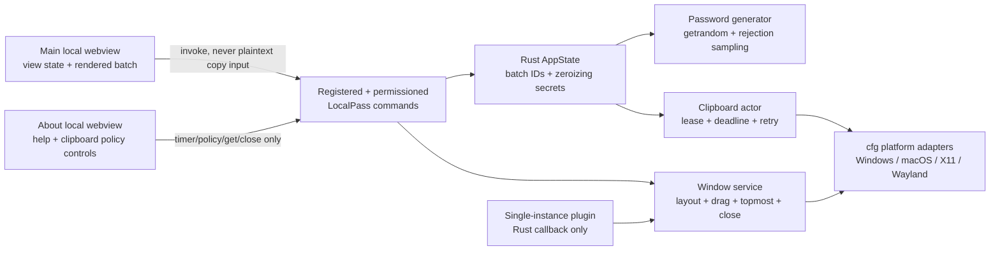

# LocalPass Tauri 2 architecture

- Status: implemented. Windows verified natively; macOS and Linux compile and pass tests in CI, runtime unverified. Wayland clipboard unsupported.
- Targets: Windows, macOS, Linux desktop
- UI: vanilla TypeScript, HTML, CSS
- Backend: Rust in Tauri 2

## Authority order

When references disagree, use this order:

1. Security and lifecycle behavior in `src/Core.cs` and `src/MainWindow.Actions.cs` at tag `wpf-checkpoint`.
2. User-facing behavior documented by `README.md` at tag `wpf-checkpoint`.
3. Visual geometry and styling in `docs/design_handoff_localpass`, a historical visual reference only; its scripts do not define behavior.

Current behavior is governed by this document and `docs/DECISION_LOG.md`.

The HTML handoff is not production security code. Its `random % n` selection is biased, and its timed clipboard overwrite can erase a newer value from another application. The Rust port must preserve `Core.cs` rejection sampling and owned-only clipboard release instead. It must also preserve the current symbol set `!@#$%^&*_-+=?`; the handoff omits `_`.

## Goals

- One local-only desktop app for Windows, macOS, and Linux.
- Preserve current generation, masking, clipboard, window, theme, accessibility, and keyboard behavior.
- The WPF implementation is preserved at tags `wpf-checkpoint` and `wpf-final` (LP-013) as the historical Windows reference.
- Keep passwords, settings, and operational state in memory only.
- Give each local webview only narrow LocalPass commands. No generic clipboard, filesystem, shell, opener, HTTP, updater, process, or persistence APIs.
- Embed all UI assets. Deny remote navigation, new windows, downloads, and network connections.

## macOS clipboard policy

Decision (2026-07-13): best-effort clipboard clearing is a macOS-only, session-only opt-in. It starts OFF on every launch and is never persisted. Each committed copy captures `NonMutating` or `BestEffortArmed`. With consent OFF, timeout/Clear/regenerate/close never mutate the pasteboard. With consent ON, only later copies are armed for `changeCount` check-then-clear. An armed lease can transition once to `BestEffortDisarmed`; no toggle or timeout change can rearm it.

The About popup keeps this exact warning visible beside the toggle and associates it with the control for assistive technology: **On macOS, auto-clear is off by default. When off, LocalPass does not remove copied passwords on timeout, Clear, regenerate, or close; they remain until something else replaces the clipboard. If enabled, LocalPass checks before clearing, but macOS cannot make that check atomic, so a copy made by another app during that race may also be cleared. Only passwords copied after enabling are affected. This setting resets off when LocalPass exits.** The UI must not describe this mode as safe or ownership-preserving.

## Non-goals

- No React or other UI framework.
- No account, sync, telemetry, analytics, crash upload, update check, or remote asset.
- No password history or settings persistence.
- No claim that WebView, IPC, OS clipboard, or immutable strings can be physically erased from RAM.
- No Snap or Flatpak in the first release. Their single-instance DBus policy needs separate packaging work.

## Process architecture



The frontend receives generated strings because it must display them. Rust retains a zeroizing batch copy so COPY can use an opaque batch ID and row index; the frontend never receives a generic clipboard write primitive.

## State ownership

| State | Owner | Notes |
|---|---|---|
| Character options, length, count | TypeScript + validated command input | Session only; Rust revalidates every field. |
| Generated batch | Rust plus rendered WebView copy | Rust stores `batch_id` and zeroizing strings. Replaced on regeneration; dropped on clear/close. |
| Mask, per-row reveal, theme, About visibility | TypeScript | All reveals reset on mask change; every result masks on window blur. |
| Clipboard lease, optional deadline, retry state | Rust clipboard actor | Frontend countdown is cosmetic. Rust deadline is authoritative when policy permits release. A monotonic release sequence prevents stale outcomes from being presented as a later operation. |
| macOS best-effort clear consent | Rust clipboard actor + About UI | `false` at startup; session-only. Each new lease captures the current policy. Disabling cancels pending mutation. |
| Pin, expanded/collapsed view, About placement, drag, close | Rust window service | Frontend requests named states, not arbitrary OS operations. |
| Single-instance lock | Rust plugin | Preserve WPF behavior: a second launch exits silently and never changes the existing window. |

## Command surface

Every command appears in two explicit lists: `tauri_build::AppManifest::commands(...)` generates its `allow-*`/`deny-*` permissions, and `Builder::invoke_handler(generate_handler![...])` registers the runtime handler. Tauri config explicitly sets `app.security.capabilities: ["localpass-main", "localpass-about"]`; it never relies on automatic capability-file discovery. `localpass-main` targets only `windows: ["main"]`. `localpass-about` targets only `windows: ["about"]` and permits timer read/update, macOS policy read/update, collapsed-opacity update, pointer-inside state, and popup close. No `core:default`, remote URL, or wildcard capability.

Every command, generated permission, runtime handler, and `tauri_build` invocation is compiled and registered on every target. Only native adapter internals use `cfg`; unsupported platform commands return typed `Unsupported`. Rust also validates the injected caller window label.

| Capability | Exact allowed commands |
|---|---|
| `localpass-main` / `main` | `generate_passwords`, `copy_password`, `clear_sensitive_state`, `clipboard_status`, `set_window_view`, `set_pointer_inside`, `set_always_on_top`, `start_window_drag`, `open_about`, `redaction_ack`, `request_close` |
| `localpass-about` / `about` | `clipboard_status`, `set_clipboard_timeout`, `set_macos_best_effort_clear`, `set_collapsed_opacity`, `set_pointer_inside`, `start_window_drag`, `close_about` |


| Command | Input | Output / rule |
|---|---|---|
| `generate_passwords` | count, length, five toggles, redacted view epoch | Validated batch ID and strings. Old UI is already synchronously redacted; Rust drops the old batch, starts prior clipboard release asynchronously, then generates without waiting. |
| `copy_password` | batch ID, row index | Rejects stale IDs and invalid bounds; copies the Rust-owned row using the actor's current timeout. macOS OFF returns `policy_off` with no deadline, never a countdown. |
| `clear_sensitive_state` | reason enum, redacted view epoch | Rejects stale epochs, drops/zeroizes the batch, then requests policy-governed release. Local state clearance and clipboard outcome are distinct; macOS OFF/disarmed never claims or performs pasteboard clear. |
| `clipboard_status` | none | `idle`, `policy_off`, `countdown`, or `release_pending`, plus effective policy and monotonic release sequence; deadline exists only for `countdown`. It never returns text or claims clear without a new adapter outcome. |
| `set_clipboard_timeout` | seconds | Rust enforces `5..60` and a multiple of five. Recomputes an `OwnershipSafe` or `BestEffortArmed` lease deadline from original copy time. `NonMutating` and `BestEffortDisarmed` remain deadline-free. |
| `set_window_view` | `expanded` or `rolled`; validated content height | Rust chooses the fixed width, clamps height/position to monitor work area, and applies the layout. |
| `set_macos_best_effort_clear` | boolean | macOS only. Defaults to `false`. `true` affects future copies only. `false` is serialized by the actor, irreversibly disarms the current lease, cancels its timer/retries, and returns only when effective. Other platforms return `Unsupported`. |
| `set_collapsed_opacity` | integer percent | About only. Rust enforces `25..75` and a multiple of five. Session-only; resets to 50 on launch. Notifies the main webview of the accepted value. |
| `set_pointer_inside` | boolean | Supplies main/About hover state for inactive-shell opacity only; hover never expands. |
| `set_always_on_top` | boolean | Changes only the main window. |
| `start_window_drag` | none | Starts native drag only for the caller-owned `main` or `about` window; no target label is accepted. |
| `open_about` | validated `dark` or `light` theme | Creates the local, taskbar-hidden popup with the main window's current session theme, resets automatic placement, and suppresses outside-collapse during internal focus handoff. |
| `close_about` | none | Destroys only the calling About popup and updates roll suppression. |
| `redaction_ack` | close ticket | Acknowledges fixed Rust-initiated DOM redaction; stale tickets are rejected. |
| `request_close` | redacted view epoch | Enters the guarded close state machine after synchronous frontend redaction. |

No command accepts a path, URL, shell text, arbitrary window label, or arbitrary clipboard string.

## Password generator

- Exact ranges: length `4..64`, count `1..99`.
- Exact character groups and ambiguous set from `src/Core.cs` at `wpf-checkpoint`.
- At least one enabled group; every enabled group contributes at least one character.
- `getrandom` OS entropy only. Entropy failure is fatal to generation; no fallback.
- Same 32-bit rejection sampling as WPF, then Fisher-Yates shuffle.
- Temporary byte/character buffers use `zeroize` where Rust ownership permits.
- Duplicate passwords are allowed, matching WPF.

Reference: [`getrandom` supported targets and entropy sources](https://docs.rs/getrandom/latest/getrandom/).

## Clipboard actor and adapters

One serialized Rust actor owns all clipboard operations. A committed copy creates:

```text
ClipboardLease {
  generation,
  native_token,
  copied_at,
  deadline, // None for NonMutating or BestEffortDisarmed
  clear_policy, // OwnershipSafe | NonMutating | BestEffortArmed | BestEffortDisarmed
  adapter_payload,
  request_loop
}
```

`clear_owned(token)` returns `Cleared`, `OwnershipLost`, `Busy`, `Unsupported`, or `Fatal`. `Busy` retries every 250 ms. A newer generation cancels stale timers. Linux adapters retain their own zeroizing payload, serve selection requests until release/ownership loss, cancel and join the request loop, then wipe the payload.
All policy changes and release triggers are FIFO actor messages. If a native release began before the actor processes disable, it finishes first and its actual outcome is returned; it cannot be recalled. The disable command then disarms the lease and acknowledges. After acknowledgment, no timeout, Clear, regenerate, close, retry, timeout change, or later OFF->ON transition can start release for that lease. UI shows a pending state until acknowledgment and reports the returned outcome rather than claiming the clipboard was not cleared.
Every actual native or policy release result advances a monotonic `release_sequence`. Status-only and no-op release commands do not advance it; a no-op release also returns no `last_release`. Each window reports a terminal outcome only when the sequence advances beyond its last observed value, preventing an older timeout result from being replayed by a later Clear or macOS policy change.

Copy outcomes are phase-specific:

- Pre-commit failure: the prior lease remains tracked.
- Destructive failure after the previous system value was removed: the prior token is invalidated; fail closed and report copy failure.
- Committed: install the validated new lease.
- Commit-uncertain, including successful text publication followed by failed validation: enter quarantine, retain cleanup metadata where possible, attempt bounded best-effort cleanup, and never pretend the prior lease still exists.

No adapter uses plaintext readback or compare-and-clear as proof of ownership.
On Windows, "LocalPass HWND" means a private message-only clipboard-owner HWND created lazily, pumped, and destroyed on the clipboard actor thread. It outlives WebView destruction while release is pending, so normal close cannot invalidate ownership proof before terminal cleanup.

| Platform | Ownership token and safe release | History / sync handling | Release bar |
|---|---|---|---|
| Windows | Preserve the Win32 transaction with a dedicated actor-thread message-only HWND, clipboard sequence, and exclusion marker; pump owner messages and check before open and again under the open clipboard lock. The owner survives WebView destruction so busy cleanup retries remain valid. | `ExcludeClipboardContentFromMonitorProcessing` before `CF_UNICODETEXT`; excludes built-in history and cross-device sync. | Exact WPF behavior required; native clipboard smoke remains mandatory. |
| macOS | Prepare `currentHostOnly`, then publish empty-data representations for `org.nspasteboard.ConcealedType`, `org.nspasteboard.TransientType`, and `org.nspasteboard.AutoGeneratedType` before publishing text last; capture the resulting `changeCount`. Default-OFF leases never call clear. Opted-in leases check `changeCount` immediately before clear, but another app can still copy between check and clear. | Only `currentHostOnly` contractually blocks Universal Clipboard. The three custom types are cooperative hints; they do not guarantee exclusion from any third-party clipboard manager or history. | Best-effort only. Requires the session toggle, persistent risk warning, per-lease policy capture, and tests for OFF/ON/disable behavior. Never claim atomic ownership preservation or third-party history exclusion. |
| Linux X11 | Dedicated hidden selection-owner window per lease; destroy only that source. `SelectionClear` records ownership loss. Build all MIME offers before claiming selection. | Advertise KDE password-manager hint. Never advertise, serve, or request `SAVE_TARGETS`, including teardown handoff. | Test with and without a clipboard manager. |
| Linux Wayland | Current GTK3/Tauri surface does not expose a per-lease `wl_data_source`, seat, and valid user-event serial with source-identity-safe teardown. The adapter returns typed `Unsupported` until a native spike proves those handles through the existing GTK/Tauri event loop; only then may it build all MIME offers before claiming selection and destroy exactly that source. | KDE hint when supported. No universal history/sync exclusion. | Current decision: **NO-GO**. Mandatory GNOME and KDE proof is still required. No speculative direct-protocol fallback and no unconditional/global clear. Until proof passes, supported Wayland release and cross-platform parity remain blocked. |

Windows references: [clipboard formats](https://learn.microsoft.com/en-us/windows/win32/dataxchg/clipboard-formats), [clipboard ownership](https://learn.microsoft.com/en-us/windows/win32/dataxchg/clipboard-operations), [sequence number](https://learn.microsoft.com/en-us/windows/win32/api/winuser/nf-winuser-getclipboardsequencenumber). macOS references: [`changeCount`](https://developer.apple.com/documentation/appkit/nspasteboard/changecount), [`currentHostOnly`](https://developer.apple.com/documentation/appkit/nspasteboard/contentsoptions). Linux references: [ICCCM selections](https://www.x.org/releases/current/doc/xorg-docs/icccm/icccm.html), [`wl_data_source`](https://wayland.freedesktop.org/docs/html/apa.html).

The Tauri clipboard plugin is intentionally absent: its unconditional clear operation cannot implement LocalPass ownership rules. [Plugin documentation](https://v2.tauri.app/plugin/clipboard/).

The renderer is also denied alternate copy paths. Password elements are not form fields and are non-selectable/non-draggable. COPY, CUT, drag, result-context-menu, `execCommand("copy")`, and `navigator.clipboard` are blocked by document-start hardening and native webview permission policy where the engine exposes one. Negative tests must prove those paths fail on WebView2, WKWebView, and WebKitGTK; otherwise Rust-only clipboard ownership is not established.

## Window behavior

- One frameless, non-resizable main window, 400 logical pixels wide at zoom 100% or below and scaling with zoom above 100% (up to 800 at 200%), with no transparent gutter or exterior window/CSS shadow, centered on first launch and shown in the Windows taskbar/macOS Dock/Linux task list, matching the WPF checkpoint.
- Rust creates the webview from local config with `create: false` in static config, then installs navigation/new-window/download denial hooks before showing it.
- Expanded height follows measured UI content but is validated and clamped to the current monitor work area.
- About is a separate local, frameless, shadow-free, taskbar-hidden 360×400 px popup. Automatic placement tries right, left, below, then above with a 14 px gap and overlaps only when the monitor work area cannot fit both windows. Its title region is natively draggable. Reopening resets automatic placement. Its validated URL query receives the current `dark` or `light` session theme; neither theme nor position is persisted.
- Expanded and About backgrounds use 90% alpha in both themes. Their whole-shell opacity is `1.0` focused, `0.95` inactive-hovered, and `0.85` inactive-idle. About exposes a session-only collapsed-opacity control from `0.25` to `0.75` in `0.05` steps, defaulting to `0.50`; hover does not change that value or flash the whole surface. High Contrast overrides this with opaque system colors.
- Collapsed mode is 40 px tall at zoom 100% or below, scaling with zoom above 100% (up to 800×80 at 200%) and capped by the monitor work area. It keeps brand, `CLICK TO EXPAND`, and a separate guarded-close control aligned with the expanded header. Its app-bar row is vertically centered, uses a distinct gap before guarded close, and limits hover feedback to the expand label. Expansion requires a collapsed-bar click or keyboard Enter/Space.
- Loss of whole-app focus collapses immediately after one event-loop deferral, allowing main↔About focus handoff. About counts as inside the app.
- Window blur immediately masks every result regardless of mask-toggle state.
- Pin controls native always-on-top. Theme, pin, position, and layout remain session-only.
- High Contrast/forced-colors detection is adapter-owned and refreshed when an OS change signal exists. It forces system colors, opaque windows, native/default control rendering, hidden theme control, no shadow/vibrancy, no opacity fades, and no roll-up. Linux/macOS use the closest platform accessibility signal plus CSS `forced-colors`; unsupported detection is documented.
- Native blur/vibrancy is optional per adapter. Linux gets an opaque/translucent fallback when compositor blur is unavailable. macOS transparency explicitly enables `app.macOSPrivateApi: true`, excluding Mac App Store distribution; signed/notarized DMG remains the target. Readability and High Contrast outrank glass fidelity.

Single-instance plugin must be registered first. Its callback intentionally does nothing so the second process exits silently, matching WPF. [Official single-instance guidance](https://v2.tauri.app/plugin/single-instance/).

### Redaction and close state machine

Frontend Clear, regenerate, and header-close paths synchronously replace/remove result text before invoking Rust. A command failure leaves the old UI redacted. Regeneration drops the old Rust batch, starts prior clipboard release asynchronously, and may display a new batch while release remains pending.

Native close/Alt+F4 calls `prevent_close`, enters one guarded `Closing` state, hides main/About immediately, and runs a fixed document redaction script with a nonce. The frontend acknowledges through `redaction_ack`. If the webview is unresponsive, Rust destroys it after a short bound; the headless clipboard actor may continue retrying. After cleanup Rust uses `destroy()` or a guarded second close so `CloseRequested` cannot recurse. App-level `RunEvent::ExitRequested` is separately prevented for bounded cleanup, then completed by a guarded programmatic exit. Forced process termination and power loss remain outside the guarantee.

References: [window close versus destroy](https://docs.rs/tauri/latest/tauri/webview/struct.WebviewWindow.html), [application run events](https://docs.rs/tauri/latest/tauri/struct.App.html).

## Webview and network boundary

- `frontendDist` is a local build directory, never a URL.
- `withGlobalTauri: false`, asset protocol disabled, prototype frozen, browser extensions disabled, release devtools absent.
- Window config sets `incognito: true`, `generalAutofillEnabled: false`, `allowLinkPreview: false`, `dragDropEnabled: false`, `devtools: false`, and `browserExtensionsEnabled: false`. Passwords never enter password/form/autofill fields. `generalAutofillEnabled` is Windows-only, so engine tests remain required elsewhere.
- No HTTP, websocket, updater, opener, shell, filesystem, process, store, logging-file, upload, or localhost server dependency.
- Production navigation allows only the embedded Tauri origin. Debug allows only the exact local Vite origin.
- Vite development binds `127.0.0.1:1420` with `strictPort: true`; HMR is disabled. The Rust navigation hook allows that exact debug origin; `devCsp` keeps `connect-src` limited to Tauri IPC.
- New windows and downloads are denied in Rust.
- No external anchors, fonts, images, media, service workers, preconnect, DNS-prefetch, or file inputs.

Baseline CSP:

```text
default-src 'self';
connect-src ipc: http://ipc.localhost;
script-src 'self';
style-src 'self';
img-src 'self';
font-src 'self';
object-src 'none';
frame-src 'none';
worker-src 'none';
media-src 'none';
base-uri 'none';
form-action 'none'
```

References: [Tauri capabilities](https://v2.tauri.app/security/capabilities/), [permissions](https://v2.tauri.app/security/permissions/), [CSP](https://v2.tauri.app/security/csp/), [configuration](https://v2.tauri.app/reference/config/).

## Dependencies

Production dependencies stay narrow and lockfile-pinned:

- Tauri 2 and `tauri-plugin-single-instance`.
- `serde` for validated command DTOs.
- `getrandom` for entropy and `zeroize` for owned secret buffers.
- Target-specific native API crates only for clipboard/window adapters, declared under Cargo target-specific dependency sections.
- No generic Tauri clipboard plugin.

Frontend build dependencies: TypeScript and Vite. Runtime frontend dependency: `@tauri-apps/api`, importing `invoke` only. Both npm and Cargo lockfiles are committed. Dependency retrieval during development/build is distinct from application runtime; release tests run with outbound traffic denied.

## Packaging

- Windows x64 NSIS with offline WebView2 installer mode, built with `--bundles nsis`. This avoids installer network access at the cost of a much larger installer.
- macOS Apple Silicon and Intel signed/notarized DMGs, built on macOS with `--bundles dmg`.
- Linux x64 AppImage and `.deb`, built with `--bundles appimage,deb` on the oldest supported CI baseline selected for WebKitGTK compatibility.
- `bundle.createUpdaterArtifacts: false`; bundle targets are never left at their default `all`.
- Native runners build every target. Cross-platform visual and clipboard proof cannot come from Windows alone.

References: [Windows WebView2 modes](https://v2.tauri.app/distribute/windows-installer/), [macOS distribution](https://v2.tauri.app/distribute/dmg/), [Linux prerequisites](https://v2.tauri.app/start/prerequisites/), [official CI patterns](https://v2.tauri.app/distribute/pipelines/github/).

## Required parity gates

- Generator vectors cover all 15 non-empty group masks, lengths 4 and 64, count 99, bounds/errors, ambiguous filtering, required-group inclusion, rejection boundary, and shuffle.
- Generate/Clear/regenerate semantics, numeric clamp/keyboard behavior, Ctrl+G/Ctrl+L, per-row COPY, mask/reveal, fixed one-line result typography with ellipsis, theme, About timer, pin, drag, roll-up, inactive masking, and High Contrast behavior match the WPF checkpoint. Ellipsis never changes the complete value copied.
- Clipboard tests cover Windows atomic overwrite preservation; macOS default-OFF non-mutation, OFF-copy/no-deadline status, opted-in `changeCount` behavior, OFF->ON non-arming, irreversible disarm across OFF->ON and timeout changes, disable-versus-deadline actor ordering, truthful adapter outcomes, and restart reset; X11/Wayland source identity; copy twice; phase-specific copy failure/commit uncertainty; busy retry; timeout; Clear; regenerate; close; and bounded session-ending cleanup.
- Second launch exits silently and does not change the first window.
- External fetch, websocket, navigation, popup, download, remote image, and unauthorized IPC tests fail.
- Windows, macOS, X11, GNOME Wayland, and KDE Wayland smoke evidence exists before cross-platform parity is claimed. macOS parity requires the approved default-OFF opt-in contract and exact warning; failed Wayland source-identity proof still blocks the parity declaration.
- Release README must affirmatively document macOS default-OFF/session-only behavior, non-clearing on timeout/Clear/regenerate/close while OFF, future-copy-only opt-in, residual clobber race, and reset on exit. Omitting the old atomic-safety claim is insufficient.
- The WPF reference is preserved at tags `wpf-checkpoint` and `wpf-final` (LP-013). The gates above remain open.
